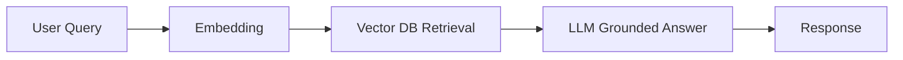
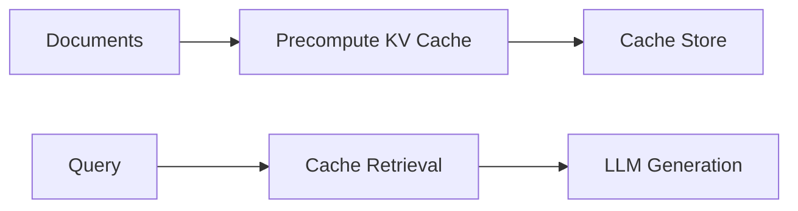
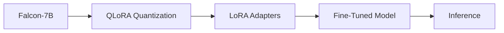

<h1 align="center">I'm Maddipatla Chetan</h1>

<i>AI Engineer · ML Researcher · B.Tech Computer Science</i>

 

 

**Turning research into production-grade AI systems** — LLMs, RAG, agents, and deep learning built end-to-end.

 

---

<h2 align="center">About Me</h2>

I'm **Maddipatla Chetan**, a **B.Tech Computer Science** student specializing in **Artificial Intelligence and Machine Learning**.

I design and build AI systems end-to-end — **Generative AI applications, LLM-powered products, RAG pipelines, agentic workflows, and computer vision solutions** — with a foundation in **NLP, Deep Learning, and MLOps**.

My focus: take an idea, validate it, build it, evaluate it, and ship it — bridging research and production with an engineering mindset.

---

<h2 align="center">What I Build</h2>

| AI Applications | LLM-powered products, RAG chatbots, agentic systems |
|---|---|
| Computer Vision | Real-time detection, surveillance intelligence |
| Model Fine-Tuning | Parameter-efficient adaptation (LoRA / QLoRA) |
| AI Infrastructure | APIs, retrieval pipelines, evaluation, deployment |

---

<h2 align="center">Tech Stack</h2>

### Programming

### AI / Machine Learning

### AI Frameworks & Libraries

### Backend

### Databases

### Tools & Cloud

---

<h2 align="center">Featured Projects</h2>

### 🛡️ GuardianAI — Multi-Agent Intelligent Surveillance

**Problem:** Real-time threat detection and alerting across surveillance video feeds.

**Solution:** A multi-agent pipeline that fuses OpenCV-based computer vision with LLM-based reasoning to detect, classify, and alert on threats automatically.

| | |
|---|---|
| **Tech Stack** | Python, OpenCV, LangChain, FastAPI |
| **AI Techniques** | Computer Vision, Multi-Agent Reasoning, Object Detection |
| **Links** | [Repository](https://github.com/MaddipatlaChetan24/guardianai-real-time-threat-detection) |

<b>Architecture Overview</b>

---

### 💬 Medical Chatbot (RAG) — Grounded Medical Assistant

**Problem:** LLMs can hallucinate on medical queries; answers must be grounded in trusted clinical documents.

**Solution:** A retrieval-augmented pipeline that embeds curated medical documents into a vector store and grounds every LLM response in retrieved evidence.

| | |
|---|---|
| **Tech Stack** | LangChain, Vector DB, FastAPI, LLMs |
| **AI Techniques** | Retrieval-Augmented Generation, Embeddings, Semantic Search |
| **Links** | [Repository](https://github.com/MaddipatlaChetan24/Medical-Chatbot-with-LLMs) |

<b>Architecture Overview</b>

---

### 🧠 Cache-Augmented Generation (CAG) — Efficient LLM Inference

**Problem:** Repeated LLM inference for similar queries is slow and costly.

**Solution:** Precomputes and reuses key-value caches, eliminating per-query re-processing for repeated contexts — a retrieval-free alternative to RAG.

| | |
|---|---|
| **Tech Stack** | Transformers, PyTorch |
| **AI Techniques** | Key-Value Caching, Inference Optimization |
| **Links** | [Repository](https://github.com/MaddipatlaChetan24/cache-augmented-generation) |

<b>Architecture Overview</b>

---

### 🤖 Falcon-7B Fine-Tuning (QLoRA) — Efficient LLM Adaptation

**Problem:** Fine-tuning 7B-parameter LLMs requires expensive GPUs.

**Solution:** Applied QLoRA quantization + LoRA adapters to fine-tune Falcon-7B on consumer hardware, adapting the model to domain tasks without full fine-tuning.

| | |
|---|---|
| **Tech Stack** | Hugging Face, Transformers, QLoRA |
| **AI Techniques** | Parameter-Efficient Fine-Tuning, 4-bit Quantization |
| **Links** | [Repository](https://github.com/MaddipatlaChetan24/falcon-7b-qlora-finetuning) |

<b>Architecture Overview</b>

---

### ✈️ Navigo AI — Multi-Agent Travel Planner

**Problem:** Travel planning spans search, logistics, and preferences — one model handles it poorly.

**Solution:** Multiple specialized agents (search, itinerary, logistics) orchestrate together to produce complete, coordinated travel plans.

| | |
|---|---|
| **Tech Stack** | Python, LangChain, FastAPI |
| **AI Techniques** | Agentic AI, Multi-Agent Orchestration, Tool Use |
| **Links** | [Repository](https://github.com/MaddipatlaChetan24/Navigo-A-Multi-Agent-Travel-Planner) |

---

### 📖 Neural Language Engine — LSTM Language Modeling

**Problem:** Explore next-word prediction at scale for language modeling.

**Solution:** Trained an LSTM-based recurrent model on large text corpora to predict next words and study sequential language patterns.

| | |
|---|---|
| **Tech Stack** | PyTorch, NLP |
| **AI Techniques** | Recurrent Neural Networks (LSTM), Language Modeling |
| **Links** | [Repository](https://github.com/MaddipatlaChetan24/Neural-Language-Engine) |

---

<h2 align="center">Research Interests</h2>

---

<h2 align="center">Currently Learning</h2>

---

<h2 align="center">AI Models Worked With</h2>

---

<h2 align="center">GitHub Statistics</h2>

---

<h2 align="center">Contribution Activity</h2>

---

<h2 align="center">Snake Contribution Animation</h2>

<i>My contribution history, animated.</i>

---

<h2 align="center">Connect With Me</h2>

---

---

<i>"Building intelligent systems that solve real-world problems."</i>

