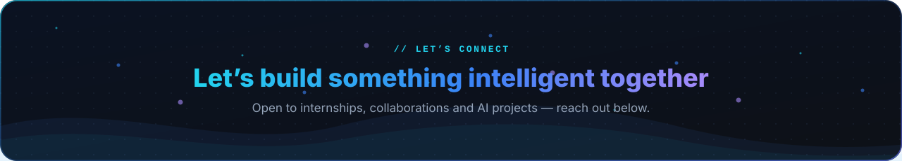

<!-- HERO -->

  

<!-- WHAT I DO -->

  

<!-- TECH STACK -->

  

<!-- DEVELOPER ID + LIVE DASHBOARD (rebuilt by the Generate Profile Cards workflow) -->

  

## 🚀 Featured builds

| Project | What it is | Stack |
|:---|:---|:---|
| [**GuardianAI**](https://github.com/MaddipatlaChetan24/guardianai-real-time-threat-detection) | Multi-agent surveillance system for autonomous threat detection and emergency response | `Python` `Google ADK` `Gemini` `YOLO` `FastAPI` |
| [**Multi-Agent Financial Coach**](https://github.com/MaddipatlaChetan24/Multi-agent-financial-coach) | Turns income, expenses, debts and goals into a practical financial plan | `Python` `Google ADK` `Gemini` |
| [**CodeSentinel**](https://github.com/MaddipatlaChetan24/CodeSentinel) | Multi-LLM code review combining AST static analysis with LLM insights | `Python` `OpenAI` `Anthropic` `Ollama` |
| [**AI Meeting Agents**](https://github.com/MaddipatlaChetan24/ai-meeting-agents) | Meeting recordings → summaries, action items and Q&A | `Whisper` `Mistral` `LangChain` `RAG` |
| [**CineMind AI**](https://github.com/MaddipatlaChetan24/CineMind-AI) | Hybrid movie recommendation engine with NLP and content-based filtering | `Python` `NLP` `TF-IDF` |
| [**Amazon ML Challenge 2026**](https://github.com/MaddipatlaChetan24/Amazon-ML-Challenge-2026) | Multi-source entity resolution with gradient boosting and a transformer re-checker | `Python` `ML` `Transformers` |

 

## 🌃 My contribution city

*Every commit builds another tower — rebuilt automatically.*

  

## 🐍 Contribution snake

<picture>
  <source media="(prefers-color-scheme: dark)" srcset="https://raw.githubusercontent.com/MaddipatlaChetan24/MaddipatlaChetan24/output/github-contribution-grid-snake-dark.svg"/>
  <source media="(prefers-color-scheme: light)" srcset="https://raw.githubusercontent.com/MaddipatlaChetan24/MaddipatlaChetan24/output/github-contribution-grid-snake.svg"/>
  
</picture>

  

<!-- LET'S CONNECT -->

  

 

**Always learning, always building.** 💙

