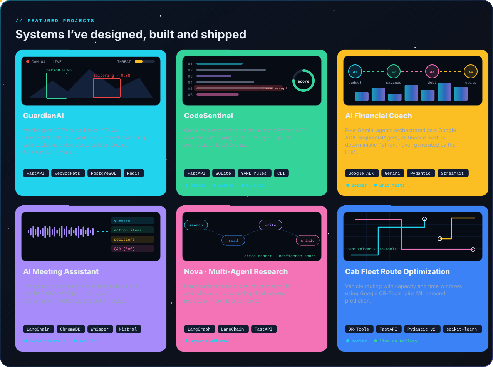
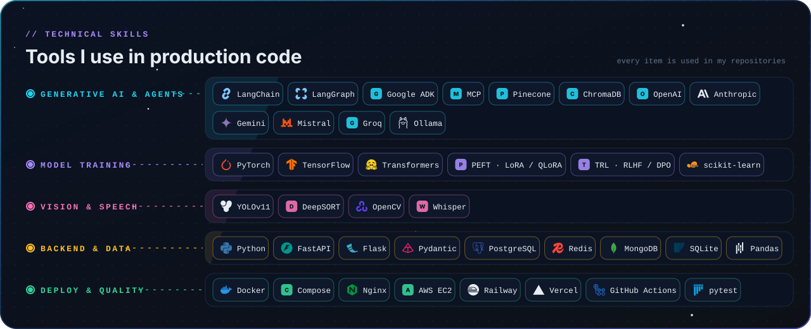

**AI / ML engineer specializing in Generative AI: LLM applications, RAG and multi-agent systems.** 
B.Tech Computer Science (Core)

[LinkedIn](https://www.linkedin.com/in/maddipatla-chetan/) · [Email](mailto:chetan121318@gmail.com)

---

<a href="https://github.com/MaddipatlaChetan24/guardianai-real-time-threat-detection">GuardianAI</a> ·
<a href="https://github.com/MaddipatlaChetan24/CodeSentinel">CodeSentinel</a> ·
<a href="https://github.com/MaddipatlaChetan24/Multi-agent-financial-coach">AI Financial Coach</a> ·
<a href="https://github.com/MaddipatlaChetan24/ai-meeting-agents">AI Meeting Assistant</a> ·
<a href="https://github.com/MaddipatlaChetan24/Multi-Agent-Research-System">Nova</a> ·
<a href="https://github.com/MaddipatlaChetan24/Cab-Fleet-Route-Optimization-System">Cab Fleet Optimization</a> (<a href="https://cab-fleet-route-optimization-system-production.up.railway.app">live</a>)

<b>More projects</b>

 

| Area | Projects |
|:--|:--|
| LLM apps & RAG | [Navigo travel planner](https://github.com/MaddipatlaChetan24/Navigo-A-Multi-Agent-Travel-Planner) (LangGraph, Groq, PostgreSQL checkpointer, Docker) · [Medical chatbot](https://github.com/MaddipatlaChetan24/Medical-Chatbot-with-LLMs) (RAG with Pinecone, LangChain) |
| LLM fine-tuning | [Falcon-7B QLoRA](https://github.com/MaddipatlaChetan24/falcon-7b-qlora-finetuning) · [LoRA fine-tuning](https://github.com/MaddipatlaChetan24/LLM-Fine-Tuning-with--LoRA) · [RLHF / DPO training](https://github.com/MaddipatlaChetan24/rlhf-custom-dataset-training) · [Cache-augmented generation](https://github.com/MaddipatlaChetan24/cache-augmented-generation) |
| Machine learning | [Amazon ML Challenge 2026](https://github.com/MaddipatlaChetan24/Amazon-ML-Challenge-2026) (team; multi-source entity resolution) · [Argus fraud detection](https://github.com/MaddipatlaChetan24/Argus-Intelligent-Credit-Card-Fraud-Detection-System) · [CineMind recommender](https://github.com/MaddipatlaChetan24/CineMind-AI) · [NLP sentiment analysis](https://github.com/MaddipatlaChetan24/nlp-sentiment-analysis) |

## GitHub activity

<picture>
  <source media="(prefers-color-scheme: dark)" srcset="https://raw.githubusercontent.com/MaddipatlaChetan24/MaddipatlaChetan24/output/github-contribution-grid-snake-dark.svg"/>
  <source media="(prefers-color-scheme: light)" srcset="https://raw.githubusercontent.com/MaddipatlaChetan24/MaddipatlaChetan24/output/github-contribution-grid-snake.svg"/>
  
</picture>
